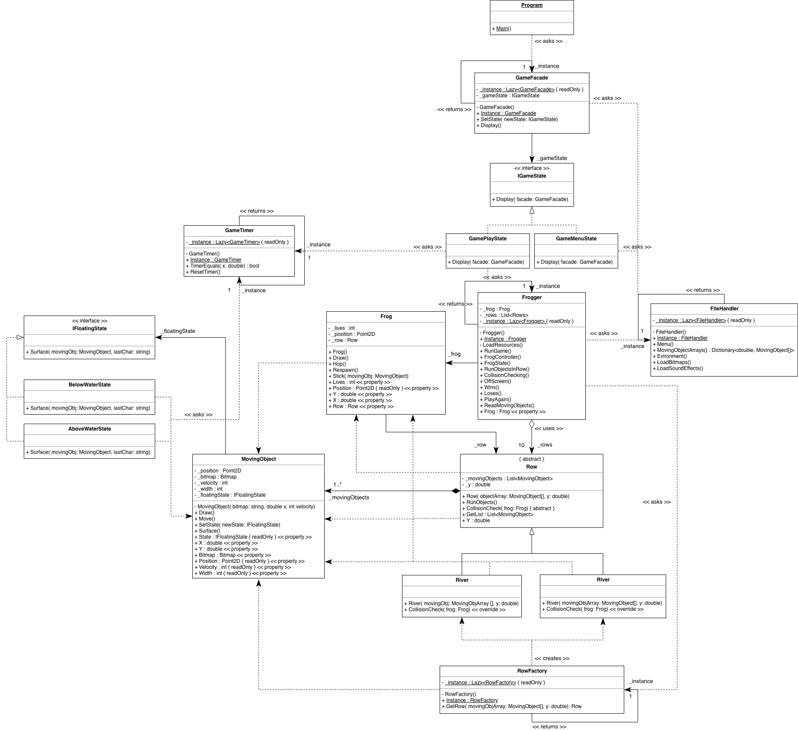
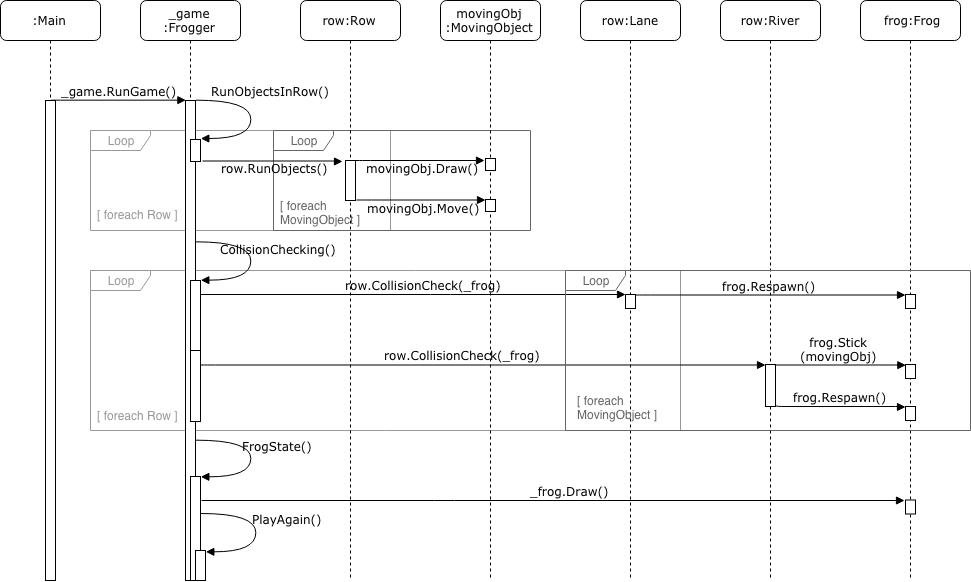
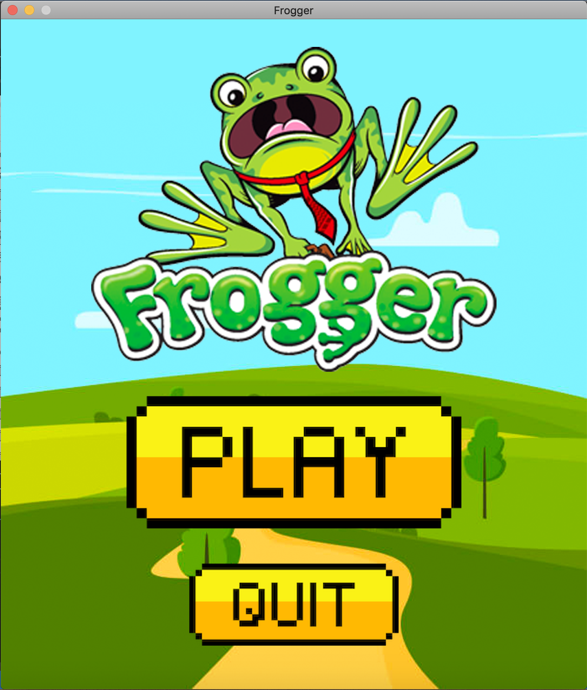
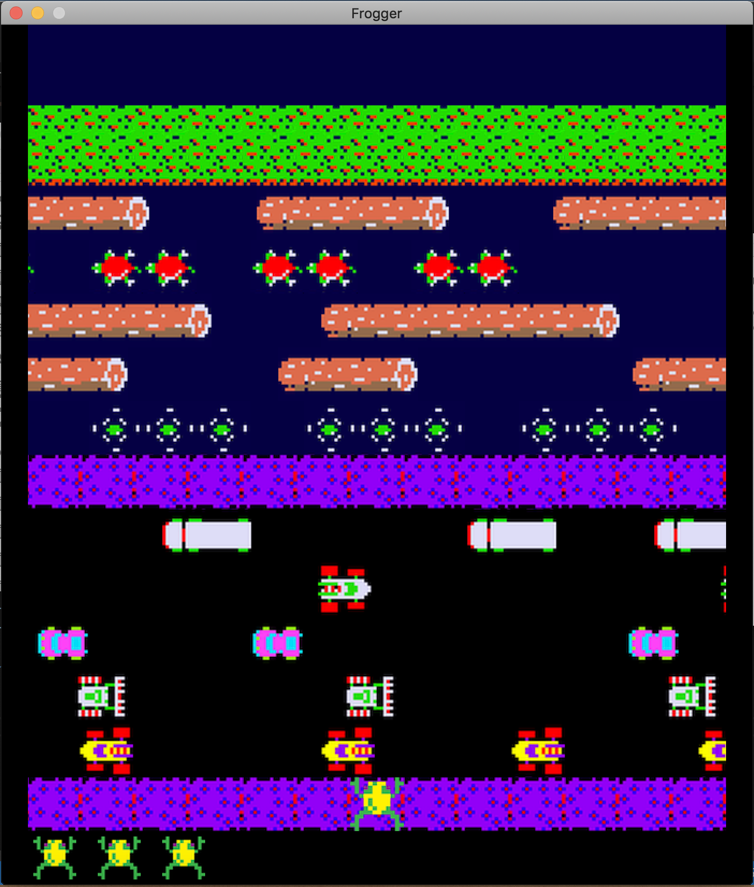
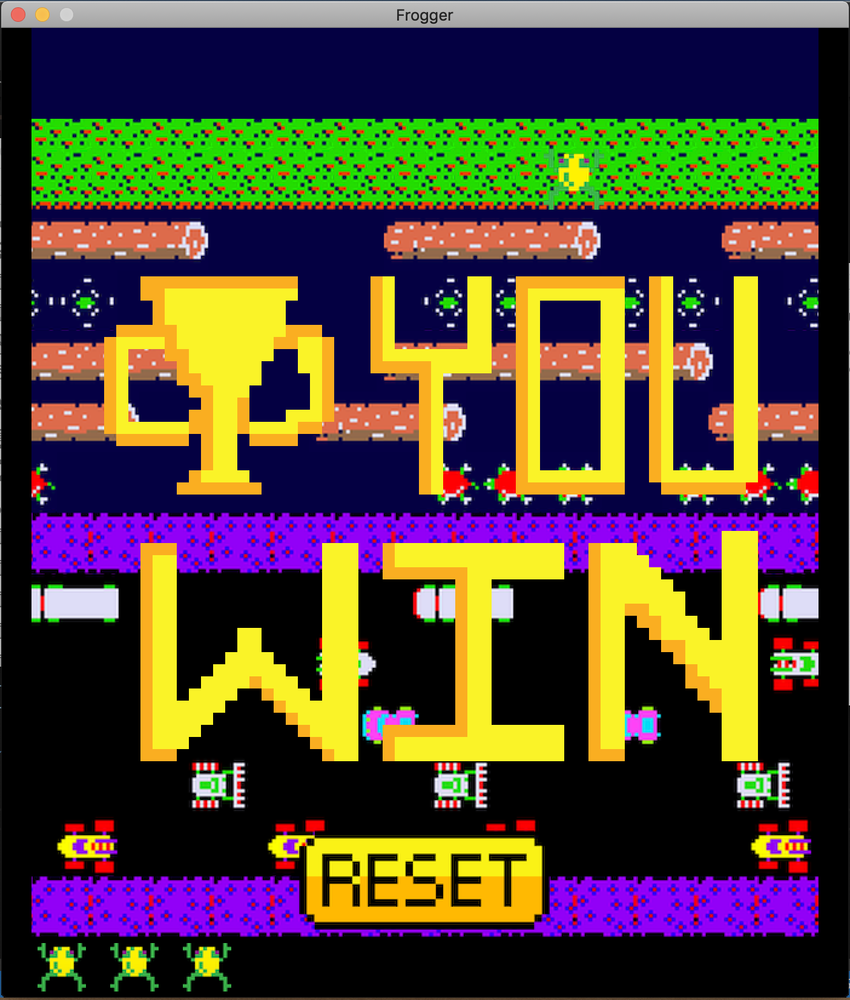
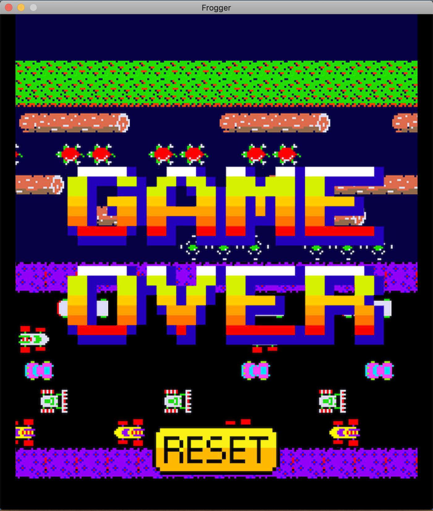

# Object Oriented Frogger
Frogger game clone written in C# utilising OO Design

## Built With
- C# - The language used
- Draw.io - The diagram software used to design the UML

## Screenshots

### UML Diagram

### Sequence Diagram

### Menu

### Gameplay

### Win

### Gameover

